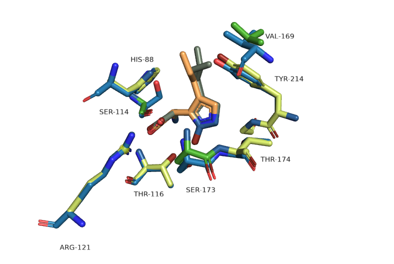
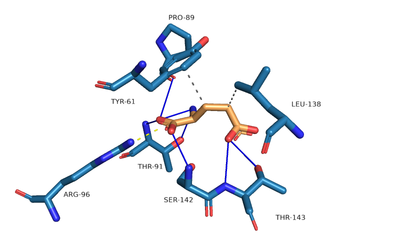
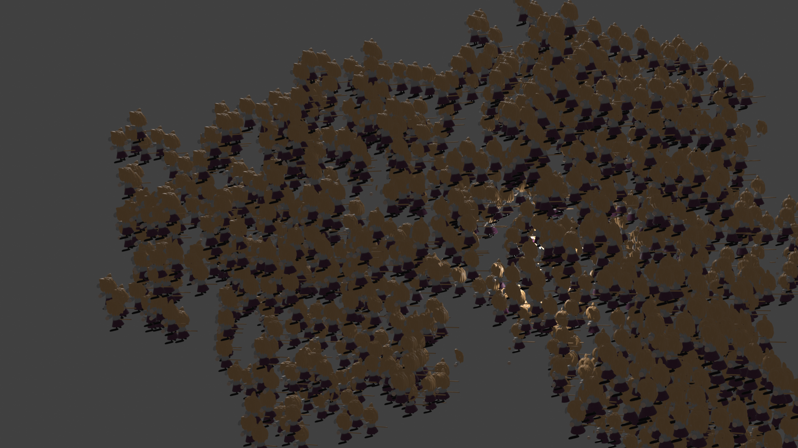

# Знакомство с PyMol
## 4JWX (GluN2A ligand-binding core in complex with propyl-NHP5G)

Белок представляет из одну из двух возможных субъединиц NMDA-рецептора(GluN2A или GluN2D), находящегося в мембранах нейронов. Рецептор является глутаматным, активируется связыванием с аганистом: глицином или глутаматом. Но для открытия ионного канала также необходима деполярищация клетки, иначе канал будет заблокирован ионами магния.
NMDA-рецептор оказывает влияние на пластичность синапсов и обучающую и запоминающую функции мозга. [^1]

В структуре модели субъединицы на PDB 4JWX нет ни глутамата, ни глицина, а вместо него лиганд с амино группой. В статье сопровождающей модель говориться, что этот лиганд справляется на 1-72% эффективности по сравнению с глутаматом. Но если посмотреть на графики в статье, то станет понятно, что 72% процента это про другой вариант субъединицы и с немного другим лигандом. [рис. 1] [^2]

<br/>
<sub>Рисунок 1. Графики эффективности двух разновидностей субъединиц. с разными лигандами. </sub>

Из рисунка 1 можно сделать вывод о том, что гидрофобное взаимодействие с пропильным хвостом лиганда крайне важно. Но чтобы разобраться с остальными важными связями. "Следует взглянуть на другой вариант субъединицы у которого эффективность значительно выше.", - подумал я и выровнял модели (4JWY и 4JWX), посмотрев на связывающий центр, не обнаружил никаких отличий. [рис. 2]. Значит дело в чем то другом, возможно в том, как субъединицы расположены в мембране.

<br/>
<sub>Рисунок 2. Выравнивание структур связывающих центров 4JWY и 4JWX. Зеленым и ярко зеленым отмечены остатки 4JWX, cиним - остатки 4JWY. Оранжевый лиганд принадлежит структуре 4JWY, серый - 4JWX</sub>

Если сравнить структуру 4JWX[рис. 4] с аналогичной ей 5H8S[рис. 3], в которой присутствует нативный глутамат, то можно увидеть как лиганд "заякоривается" гистидином в обоих случаях и поддерживается двумя гидрофобными взаимодействиями. Возможно предложенный в статье лиганд на 28% менее эффективен чем глутамат из-за своей стехиометрии и неверной стабилизацией пи-стекингом.

<br/>
<sub>Рисунок 3. Активный центр 5H8S. Пунктирные серые связи - гидрофобные взаимодействия, непрерывные синие - водородные связи, пунктирные желтые - соляные мостики. Оранжевым обозначен лиганд, синим аминокислотные остатки белка. </sub>

<br/>
<sub>Рисунок 4. Активный центр 4JWX. Пунктирные серые связи - пи-катионный стекинг, непрерывные синие - водородные связи, пунктирные желтые - соляные мостики, пунктирные фиолетовые связи - гидрофобные взаимодействия. Серым обозначен лиганд, оттенками зеленого аминокислотные остатки белка. </sub>нке 

## О картинке 4JWX

Для подбора цветов я использовал [Adobe Color Wheel](https://color.adobe.com/create/color-wheel).</br>
Для красивого рендера я использовал следующие команды:
```
unset specular

set ray_trace_gain, 0

set ray_trace_mode, 3

bg_color white

set ray_trace_color, black

unset depth_cue

ray
```
[**Скачать PyMol сессию**](https://raw.githubusercontent.com/Jahysama/structbio/main/prac1/4jwx.pse)

## Смешное
Я экспортировал модель в Blender и заменил все атомы на neko arc.[рис. 5].[^3] Вышло не очень, было сложно редактировать, у меня слабый графический процессор.

<br/>
<sub>Рисунок 5. модель белка 4JWX в которой все атомы заменены на nekoarc. </sub>

## Литература и ссылки

[^1]: **Memory and the NMDA receptors**
    > Li F, Tsien JZ (July 2009). "Memory and the NMDA receptors". The New England Journal of Medicine. 361 (3): 302–303. https://doi.org/10.1056%2FNEJMcibr0902052.
 
[^2]: **Structure complementary paper** 
    > Hansen KB, Tajima N, Risgaard R, Perszyk RE, Jørgensen L, Vance KM, Ogden KK, Clausen RP, Furukawa H, Traynelis SF. Structural determinants of agonist efficacy at the glutamate binding site of N-methyl-D-aspartate receptors. Mol Pharmacol. 2013 Jul;84(1):114-27. https://doi.org/10.1124/mol.113.085803.

[^3]: **Pymol2Blender youtube tutorial**
    > https://www.youtube.com/watch?v=5ZFVUej-bZs
