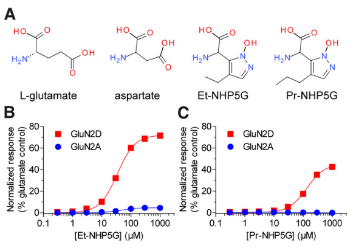
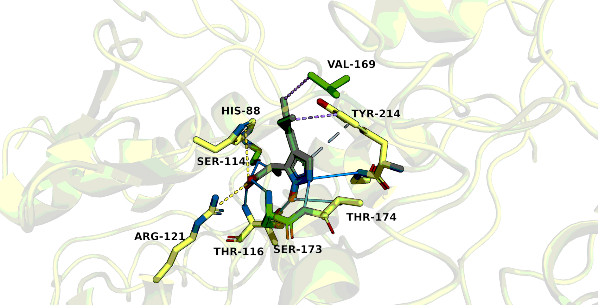

# Знакомство с PyMol
## 4JWX (GluN2A ligand-binding core in complex with propyl-NHP5G)

Белок представляет из одну из двух возможных субъединиц NMDA-рецептора(GluN2A или GluN2D), находящегося в мембранах нейронов. Рецептор является глутаматным, активируется связыванием с аганистом: глицином или глутаматом. Но для открытия ионного канала также необходима деполярищация клетки, иначе канал будет заблокирован ионами магния.
NMDA-рецептор оказывает влияние на пластичность синапсов и обучающую и запоминающую функции мозга. [1]

В структуре модели субъединицы на PDB 4JWX нет ни глутамата, ни глицина, а вместо него лиганд с амино группой. В статье сопровождающей модель говориться, что этот лиганд справляется на 1-72% эффективности по сравнению с глутаматом. Но если посмотреть на графики в статье, то станет понятно, что 72% процента это про другой вариант субъединицы и с немного другим лигандом. [рис. 1] [2]

Из рисунка 1 можно сделать вывод о том, что гидрофобное взаимодействие с пропильным хвостом лиганда крайне важно. Но чтобы разобраться с остальными важными связями, следует взглянуть на другой вариант субъединицы у которого эффективность значительно выше.

## Литература

1. **Memory and the NMDA receptors**
    > Li F, Tsien JZ (July 2009). "Memory and the NMDA receptors". The New England Journal of Medicine. 361 (3): 302–303. https://doi.org/10.1056%2FNEJMcibr0902052.
 
1. **LeDock** 
    > Wang Z, Sun H, Yao X, Li D, Xu L, Li Y, et al. Comprehensive evaluation of ten docking programs on a diverse set of protein–ligand complexes: the prediction accuracy of sampling power and scoring power. Phys Chem Chem Phys. 2016;18: 12964–12975. https://doi.org/10.1039/C6CP01555G.
 
1. **AutoDock Tools**
    > Morris, G. M., Huey, R., Lindstrom, W., Sanner, M. F., Belew, R. K., Goodsell, D. S., & Olson, A. J. (2009). AutoDock4 and AutoDockTools4: Automated docking with selective receptor flexibility. Journal of computational chemistry, 30(16), 2785–2791. https://doi.org/10.1002/jcc.21256.
