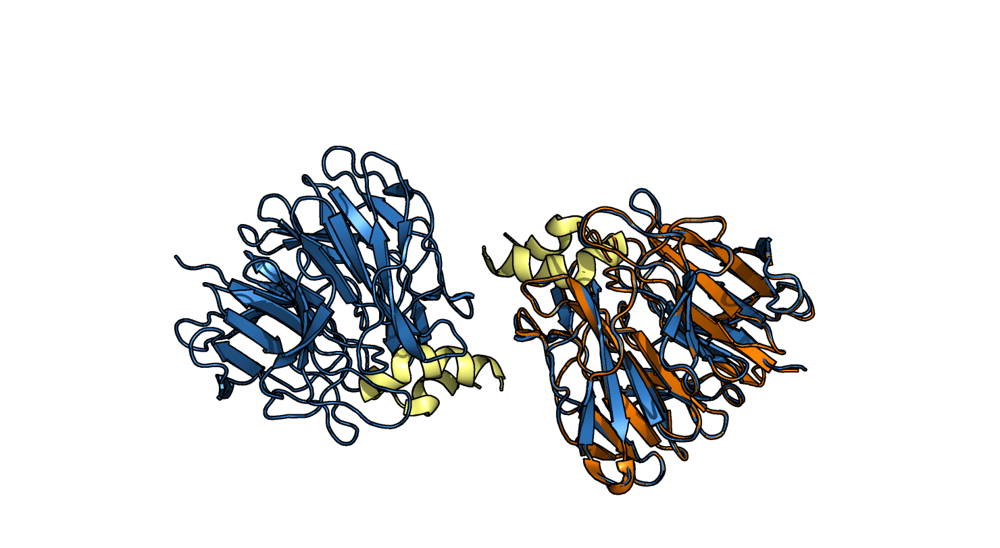
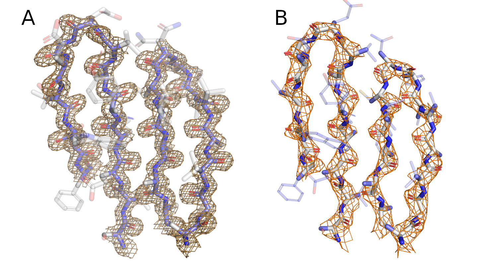
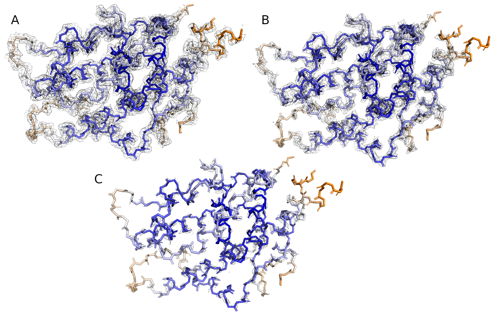
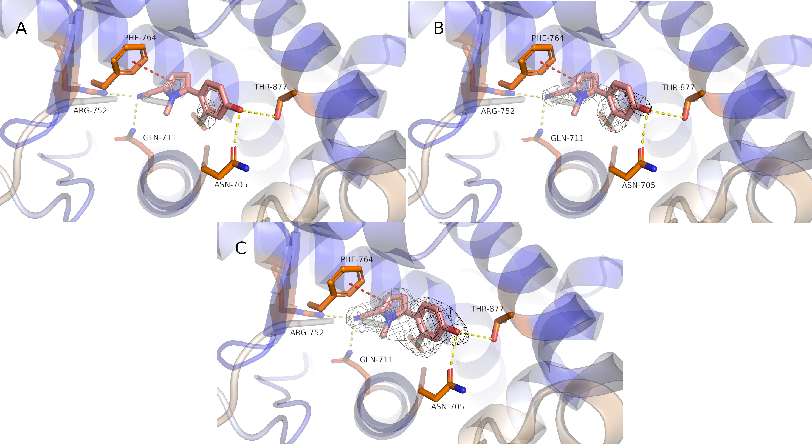

# Электронная плотность
## Задание 1: Оценка качества модели

Для сравнения качества моделей было дано две модели 3WN7 и 3ADE. 3ADE хорошо выровнилась командой `align` на одну из субъединиц 3WN7, так же в 3WN7 содержится по одной альфа спирали на каждую субъединицу, которых нет в другой модели.[рис. 1] Ниже приведена таблица с качественными характеристиками обоих моделей.

<br/>
<sub>Рисунок 1. Выравнивание 3ADE на 3WN7. Синим цветом обозначены 2 субъединицы белка 3WN7, желтым его альфа спирали, оранжевым белок 3ADE</sub>

|       |                               3WN7                   | 3ADE | Лучшая модель  |
|:--------------:|:------------------------------------------------------------:|:------:|:------:|
|     Разрешение    |        1.57 Å    | 2.80 Å | 3WN7 |
|      Кол-во уникальных рефлексов    |      93450    | 8442 |3WN7 |
|      Полнота рефлексов    |    98.8%     | 100.0%  |3ADE |
|      Длина волны падающего излучения   |    0.9 Å | 1.0 Å   | 3WN7|
|      Источник радиации на синхротроне  |    SPRING-8 |  PHOTON FACTORY  | 3WN7|

<sub>Таблица 1. Качественные характеристики моделей</sub>

Как можно увидеть из таблицы 1, более низкое разрешение 3ADE можно объяснить длинной волны излучателя, кол-вом уникальных рефлексов. А также помимо этого разницы в типах радиации на синхронтронах, SPRING-8 будет поновее на 15 лет чем PHOTON FACTORY и возможно получше.[^1]

<br/>
<sub>Рисунок 2. A. Электронная плотность остова бета листа структуры 3WN7 (Позиции: 510-522, 533-546) B. Электронная плотность остова бета листа структуры 3ADE (Позиции: 510-522, 533-546)</sub>

На рисунке 2 наглядно видно сравнительное качество моделей. На рисунке A электронная плотность имеет более угловатый и плоский вид, в то время как на рисунке B электронная плотность округлая и обрисовывает отдельные атомы остова.[^2]

##  Рендер
Чтобы зарендерить адекватный mesh при помощи ray в PyMol я использовал следующие команды:
```
set transparency, 0.5
set transparency_mode, 1
set backface_cull, 0
set two_sided_lighting, 1
set ray_shadows, 0
set ray_trace_mode, 0
set mesh_width, 0.9
set mesh_color, orange
```

## Задание 2: Оценка локального качества модели 5VO4

Как можно увидеть на рисунке 3, что с увелечением уровня подрезки , отображение электронной плотности начинает пропадать там где B-фактор наибольший, то есть где температурная подвижность наиболее активная, а следовательно электронная плотность наиболее размыта. Это в первую очередь на поверхности белка в позициях 849-852, 864, 670, 919. Темным синим выделена наименее подвижная часть белка, с которой отображение электронной плотности совсем не пропало.

<br/>

<sub>Рисунок 3. A. Электронная плотность остова 5vo4 на уровне подрезки - 1 B. Электронная плотность остова 5vo4 на уровне подрезки - 2 C. Электронная плотность остова 5vo4 на уровне подрезки - 3  Все структуры покрашены по B- фактору: оранжевый - максимальный B-фактор, синий - минимальный B-фактор</sub>


## Задание 3: Оценка качества лиганда 5VO4

Рисунок 4 демонстрирует как отображение электронной плотности лиганда меняется в зависимости от подрезки. Лиганд расположен в центре белка в наименее подвижной и наиболее плотной зоне. На рисунке 4 видно что лиганд удерживается 4-мя водородными связями и одним пи-стекингом. На рисунке 4A также можно заметить как атом фтора и атомы азота в лиганде стягивают на себя электронную плотность колец, в которых и рядом с которыми находятся.

<br/>

<sub>Рисунок 4. A. Электронная плотность лиганда 5vo4 на уровне подрезки - 3 B. Электронная плотность лиганда 5vo4 на уровне подрезки - 2 C. Электронная плотность лиганда 5vo4 на уровне подрезки - 1  Желтым обозначены водородные связи, красным - перпендикулярный пи-стекинг</sub>

## Литература и ссылки

[^1]: **Photon Factory**
    > https://www2.kek.jp/imss/pf/

[^2]: **PDB 101**
    > https://pdb101.rcsb.org/learn/guide-to-understanding-pdb-data/resolution
    
